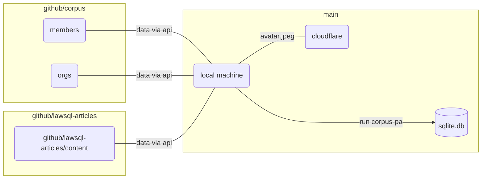

# corpus-pax

Setting up the initial, foundational tables with generic users, organizations, and articles.



Implies _updated_ Github repositories:

1. `corpus` (for entities, i.e. members and orgs) and
2. `lawsql-articles` (markdown style articles).

With respect to entities, data concerning members will be pulled from such repository. Each avatar image should be named `avatar.jpeg` so that these can be uploaded to Cloudflare.

## Install

```zsh
poetry add corpus-pax
poetry update
```

## Supply .env

Create an .env file to create/populate the database. See [sample .env](.env.example) highlighting the following variables:

1. Cloudflare `CF_ACCT`
2. Cloudflare `CF_TOKEN`
3. Github `GH_TOKEN`
4. `DB_FILE` (sqlite)

Note the [workflow](.github/workflows/main.yml) where the secrets are included for Github actions. Ensure these are set in the repository's `<url-to-repo>/settings/secrets/actions`, making the proper replacements when the tokens for Cloudflare and Github expire.

### Notes

#### Why Github

The names and profiles of individuals and organizations are stored in Github. These are pulled into the application via an API call requiring the use of a personal access token.

#### Why Cloudflare Images

Individuals and organizations have images stored in Github. To persist and optimize images for the web, I use Cloudflare images.

#### Why sqlite

The initial data is simple. This database however will be the foundation for a more complicated schema. Sqlite seems a better fit for experimentation and future embeddability of the same for app use.

## Steps

### Review database connection

Need to specify filename, e.g. ex.db, for this to created in the root directory of the project folder.
Without the filename, the `Connection` (sqlite-utils' Database() under the hood) used is the path declared in $env.DB_FILE

```python
from sqlpyd import Connection  # this is sqlite-utils' Database() under the hood

c = Connection(DatabasePath="ex.db", WALMode=False)
```

### Add persons

Create and populate the _persons_-related tables:

```python
from corpus_pax import init_persons

init_persons(c)
```
